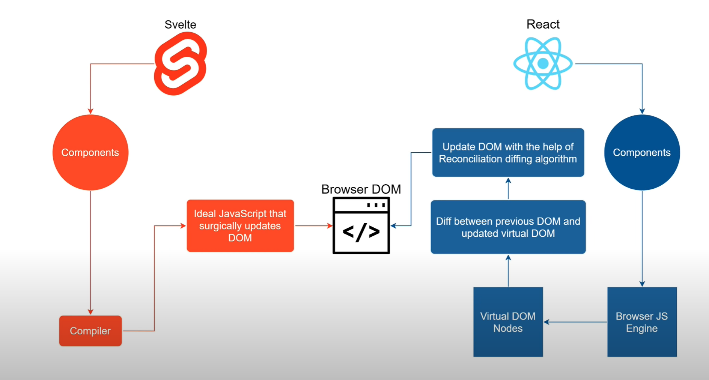

# Svelte Feedback App

This is the project from the Svelte



## About Svelte

```
1. What is the Svelte?
Svelte is a compiler that generates minimal and highly optimized Javascript code.
・Svelte works a bit different than traditional frameworks, but does a log of the same things. It's often called a framework.
・Svelte compiles everything down to pure JS

2. Why Use Svelte?
・Create dynamic frontend UIs
・Produces highly optimized JS
・No virtual DOM
・About 30% faster than other frameworks
・Great out of the box animations/transitions
・Great ecosystem(SvelteKit, Svelte Native)
・Ease of use

3. What should you know first?
Like with any framework, you should be comfortable with the underlying language first.
In this case, that is Javascript
・Javascript fundamentals
・Async Programming (promises)
・Array Methods (forEach, map, filter, etc)
・Fetch API/ HTTP Requests
・NPM(Node Package Manager)

4. Svelte Components
Components are reusable pieces of the UI including the output(html), logic(JS) and styling(CSS).
All 3 are encapsulated in a svelte component

5. Visual Studio Code Extension For Svelte
Svelte for VS Code
```

## Create Project

```
npx degit sveltejs/template svelte-feedback-app
cd svelte-feedback-app/ && npm install
# to use TypeScript run:
# node scripts/setupTypeScript.js
npm i uuid
npm run build
```

## Clone Project

```
git clone

# Install dependencies
npm install

# Dev server
npm run dev (http://localhost:5000)

# Prod server
npm start

# Build for production
npm run build

```

## Reference

- [YT-Tutorial](https://www.youtube.com/watch?v=3TVy6GdtNuQ)
- [SVELTE-Started](https://svelte.dev/blog/the-easiest-way-to-get-started)
- [SVELTE-DOCS](https://svelte.dev/docs)
